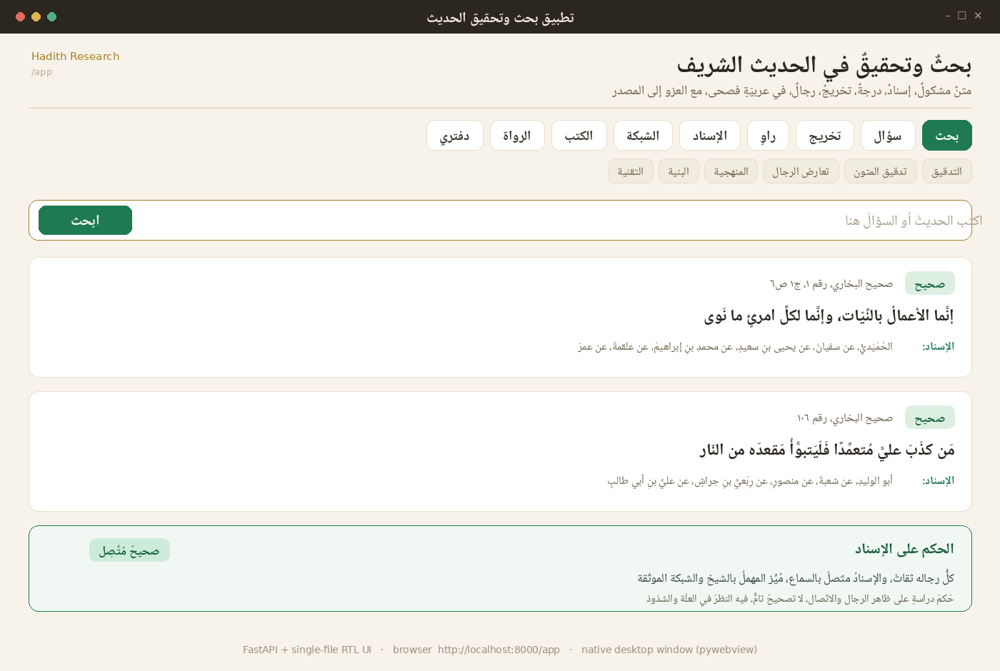
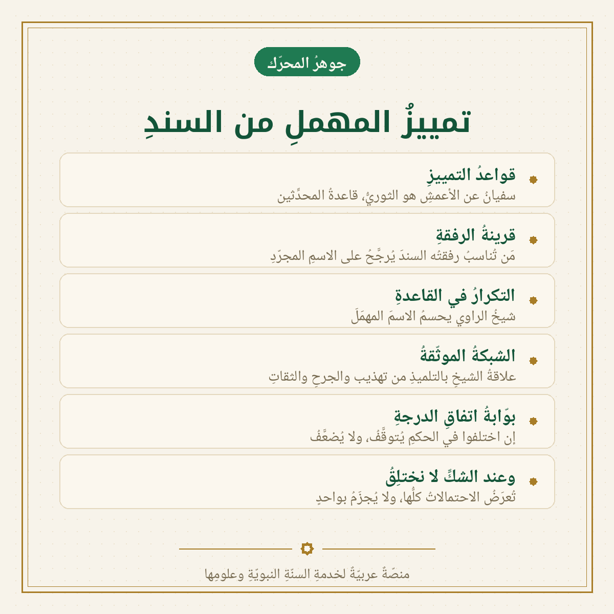
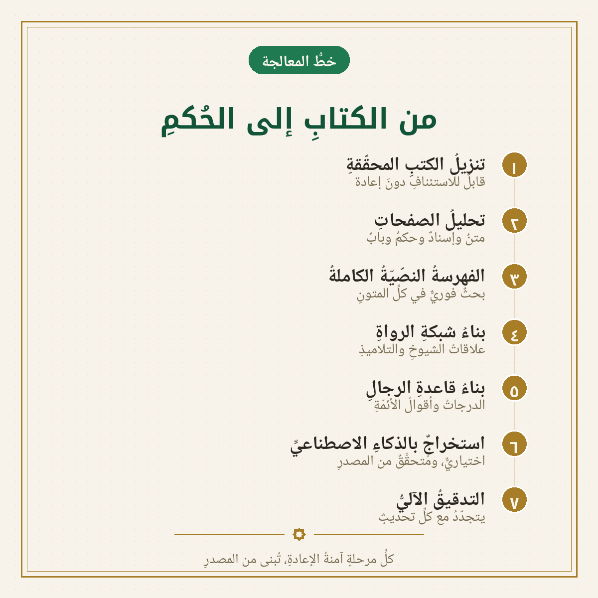

<div align="center">

# بحث وتحقيق الحديث
### Hadith Research &amp; Isnād Verification

**نظامٌ عربيٌّ ذكيٌّ للبحثِ في السنّةِ النبويّةِ، وتحقيقِ الأسانيدِ، ومعرفةِ الرواةِ ودرجاتِهم، والتخريجِ وكشفِ العلل — يعملُ على جهازِك، دونَ إنترنت.**

*An AI‑powered, local‑first system for searching the Prophetic traditions, verifying the chains of narration (isnād), grading the narrators, and detecting hidden defects (ʿilal) — entirely in Classical Arabic, fully offline.*


</div>



---

## نظرة عامة · Overview

في علمِ الحديثِ، الخطأُ في النسبةِ خطأٌ جسيم. لذلك بُنيَ هذا النظامُ على قاعدةٍ واحدة: **لا يختلِقُ شيئًا** — يسترجعُ النصَّ من مصادرِه المحقّقةِ، ويوثّقُه (كتابٌ · جزءٌ · صفحةٌ · رقمٌ · درجة)، ويُحلّلُ سندَه راويًا راويًا، ثمّ يُبيّنُ ما يُعرَفُ وما يُتوقَّفُ فيه. وكلُّ معطًى يعودُ إلى نصٍّ مصدريٍّ يُمكنُ مراجعتُه.

In this domain a wrong attribution is a serious error, so the system is built on one rule: **it never fabricates.** It retrieves a tradition from real, edited sources, cites it (book · volume · page · number · grade), reasons over its chain narrator‑by‑narrator, and then states what is *known* versus what must be *held*. Every datum traces back to a verifiable source text.

---

## ✨ المزايا · Features

- 🔎 **بحثٌ بالمعنى لا باللفظِ فحسب** — هجينٌ دلاليٌّ ولفظيٌّ في أكثرَ من ٨٤٬٠٠٠ حديثٍ.
  &nbsp;&nbsp;*Hybrid semantic + lexical search over 84,000+ traditions.*
- 🧬 **تحقيقُ الإسناد** — تمييزُ الراوي المهمَلِ من السندِ لا من الاسمِ المجرّد، والحكمُ على الاتّصالِ والرواة.
  &nbsp;&nbsp;*Isnād verification: identify an ambiguous narrator from the chain, then grade the chain.*
- 👤 **معرفةُ الرواة** — قاعدةٌ موحَّدةٌ لأكثرَ من ٢٣٬٠٠٠ راوٍ بدرجاتِهم وأقوالِ النقّادِ فيهم، بلا تكرار.
  &nbsp;&nbsp;*A canonical base of 23,000+ transmitters with gradings and named critics' verdicts.*
- 🕸️ **التخريجُ وكشفُ العلل** — جمعُ الطرقِ، وقرائنُ التفرّدِ والشذوذِ والاضطرابِ والرفعِ والوقفِ.
  &nbsp;&nbsp;*Takhrīj + structural ʿilal hints (tafarrud, shudhūdh, idṭirāb, rafʿ/waqf…).*
- 📚 **تصفّحُ الكتبِ وقراءتُها** — أمّهاتُ كتبِ السنّةِ وشروحِها، تصفّحًا وبحثًا وقراءةً.
  &nbsp;&nbsp;*Browse and read the major collections and their commentaries.*
- 🔒 **محليٌّ وخاصٌّ بالكامل** — يعملُ دونَ إنترنت، على المعالجِ وحدَه، بلا قاعدةِ بياناتٍ خارجيّة.
  &nbsp;&nbsp;*Local‑first &amp; private: offline, CPU‑only, no external database.*

---

## ⚙️ كيف يعمل · How it works

النواةُ هي **تمييزُ المهملِ من السند**: حين يَرِدُ اسمٌ مشتركٌ بين رواةٍ، يُعرَفُ صاحبُه من سياقِ السندِ (شيخِه وتلميذِه) لا من الاسمِ المجرّد — بقواعدِ المحدِّثينَ، وقرينةِ الرفقةِ، وشبكةٍ موثَّقةٍ للشيوخِ والتلاميذِ، فإن لم يَحسِمْها دليلٌ تَوقّفَ ولم يختلِقْ.

The core is **disambiguating the unnamed narrator from the chain**: when a name is shared by several men, the right one is resolved from the surrounding chain (his teacher and student) rather than the bare token — via classical disambiguation rules, the «company» heuristic, and a documented teacher↔student network. When the evidence is inconclusive, it holds rather than guesses.

<div align="center">


</div>

📐 **التفصيل الكامل في [`docs/ARCHITECTURE.md`](docs/ARCHITECTURE.md)** — a code‑accurate map of the whole system.

---

## 📊 بالأرقام · By the numbers

| | |
|---|---|
| 📖 الأحاديث المفهرسة · indexed traditions | **+٨٤٬٠٠٠** |
| 👤 الرواة بدرجاتِهم · graded narrators | **+٢٣٬٠٠٠** |
| ✅ تغطيةُ رجالِ الأسانيد · isnād coverage | **٩٤٪** |
| 📚 مصادرُ الرجالِ · biographical sources | **٩** |
| 🧪 اختباراتُ الجودة · automated tests | **+٥٦٠** |

كتبُ السنّة: البخاري · مسلم · السننُ الأربعة · الموطّأ · مسندُ أحمد · ابنُ خزيمة · ابنُ حبّان · المستدرك · الدارقطنيّ &nbsp;—&nbsp; وكتبُ الرجال: تقريبُ التهذيب · الكاشف · تهذيبُ الكمال · الجرحُ والتعديل · الإصابة · الثقات · لسانُ الميزان · سيرُ أعلام النبلاء · تاريخُ الإسلام.

---

## 🧱 التقنية · Tech stack

**Python · FastAPI · SQLite** (FTS5 full‑text + vector BLOBs) · **sentence‑transformers** (Arabic, 768‑dim) · **pywebview** (desktop) — a single‑file HTML/JS/SVG UI, no external libraries, no cloud. The optional LLM layer (off / local / remote) is constrained to the retrieved sources and always cites.

An 8‑step, idempotent pipeline turns raw books into the searchable corpus: **download → parse → index → narrator graph → rijal base → (optional AI extraction) → self‑audit.** A self‑auditing layer re‑checks every chain and text, backed by 560+ automated tests.

---

## ▶️ التشغيل · Quickstart

### ⚡ بأمرٍ واحد · One command

```bash
git clone https://github.com/a7medhosny92-cpu/hadith-research-backend
cd hadith-research-backend
./setup.sh                 # Windows: double‑click setup.bat
```

`setup.sh` is **self‑contained**: it creates a virtual environment, installs the app, **downloads the books from [turath.io](https://app.turath.io/), and builds the entire corpus** (parse → index → narrator graph → rijal base → self‑audits). It is resumable — safe to re‑run. *Add `--semantic` for «smart» semantic search (downloads a model).*

Then start it:

```bash
source .venv/bin/activate
uvicorn app.main:app                    # → http://localhost:8000/app   (API docs at /docs)
# …or the native desktop window:
python -m app.desktop                   # console script: hadith-app
```

<details><summary>أو خطوةً خطوة · Or step by step</summary>

```bash
python -m venv .venv && source .venv/bin/activate
pip install -e ".[dev,desktop]"         # add ",embeddings,llm" for semantic search / RAG
python -m scripts.update --no-git       # download the books + build the whole corpus
# (the stages, if you prefer: scripts.ingest → parse → index → build_graph → build_rijal)
uvicorn app.main:app
```

Already installed? `python -m scripts.update` pulls the latest code **and** refreshes the corpus.
</details>

---

## 🗺️ ما تبقّى · Roadmap

- 🧠 نموذجٌ عصبيٌّ لكشفِ العللِ والتخريجِ · a neural model for ʿilal/takhrīj *(needs a GPU)*
- 🔝 إعادةُ ترتيبٍ ذكيّةٌ للنتائج · a learned reranker for search
- 🌐 نشرٌ على خادمٍ للجميع · a public server deployment
- 📚 توسيعُ مصادرِ الرواةِ المتأخّرين · more late‑period biographical sources

---

## 📖 المنهج والأمانة · Methodology &amp; trust

كلُّ نتيجةٍ موثَّقةٌ بكتابِها، والدرجاتُ والأقوالُ منقولةٌ بأسماءِ أصحابِها مع مراجعِها. الإشاراتُ إلى العللِ والشذوذِ **قرائنُ للنظرِ، لا أحكامٌ نهائيّة**. النصوصُ من المكتبةِ التراثيّةِ المحقّقةِ، وتبقى حقوقُها لأصحابِها؛ هذا العملُ أداةٌ للبحثِ والدراسةِ لا بديلٌ عن أهلِ العلم.

Every result is cited to its book; grades and verdicts carry the names of the critics who issued them, with their source works. The ʿilal/shudhūdh signals are **hints to investigate, never final rulings.** Source texts belong to their rights‑holders; this is a research and study aid, not a substitute for qualified scholars.

<div align="center">

—  ﴿ وَقُل رَّبِّ زِدْنِي عِلْمًا ﴾  —

</div>
